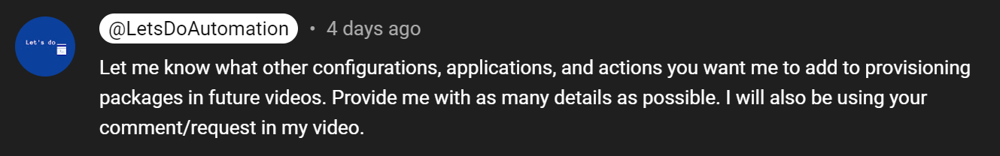
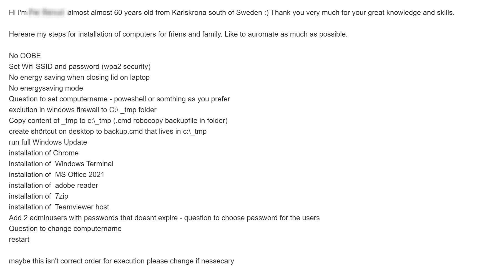
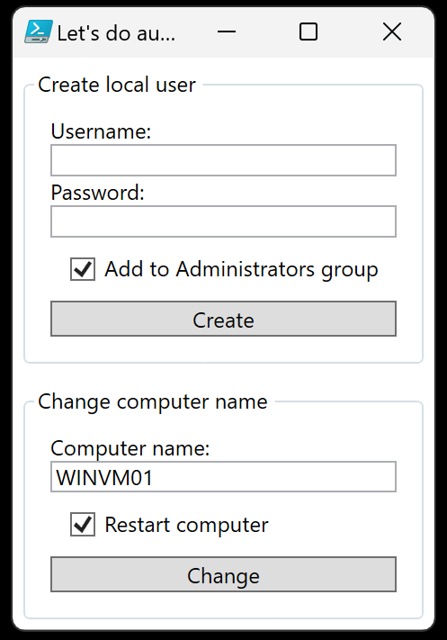

# Windows Configuration Designer: Creating viewer requested Windows automation package 01

<b>My offer:</b>



<b>Response:</b>



<b>Updated request:</b>

* Disale privacy menu
* Install Notepad++
* Desktop icons This computer, Network, Control panel 
* Install uBlock Google Chrome extension
* Pin Google Chrome, File Explorer, Calculator, Outlook, Notepad++, PowerShell ISE, Windows Terminal to taskbar

## Package execution order:

* <b>STAGE 1</b> Actions performed in OOBE:
    * Skip OOBE
    * Configure WiFi and autoconnect
    * Execute oobe-setup.ps1
        * Execute oobe-powersettings.ps1
            * Disable sleep
            * Set close lid action to nothing
        * Execute oobe-deploy-tmp.ps1
            * Deploy random files using 7-Zip self-extracting archive
            * Exclude C:\\_tmp in Windows Defender
            * Create BackupUSB desktop shortcut that executes RobocopyBackup.bat in C:\\_temp folder
        * Execute oobe-chocolatey.ps1
            * Install Chocolatey package manager
        * Execute oobe-chrome-extensions.ps1
            * Install uBlock chrome extension
        * Create C:\ProgramData\provisioning folder
        * Move files from provisioning package to C:\ProgramData\provisioning
        * Create user "admin" without password
        * Configure RunOnce to execute desktop-update-provisioning.ps1
        * Configure Active Setup to import desktop-icons.reg
        * Disable Privacy Experience menu

* <b>STAGE 2</b> Actions performed in admin users desktop:
    * Active Setup imports desktop-icons.reg
        * Enable users documents desktop icon
        * Enable This PC desktop icon
        * Enable Network desktop icon
        * Enable Control Panel desktop icon
    * RunOnce executes desktop-update-provisioning.ps1
        * Wait for internet connection
        * On first run install everything needed for Get-WindowsUpdate PowerShell module
        * Run Windows Updates and restart the computer until there is no more Windows updates
        * Execute desktop-software-provisioning.ps1
            * Install chocolatey packages:
                * Notepadd++
                * Adobe Reader
                * Google Chrome
                * 7-Zip
                * Teamviewer Host
            * Install Microsoft Office ProPlus 2021 Volume with ODT
            * Execute desktop-configure-taskbar.ps1
                * Pin Google Chrome
                * Pin File Explorer
                * Pin Calculator
                * Pin Outlook
                * Pin Notepad++
                * Pin PowerShell ISE
                * Pin Windows Terminal
            * Execute desktop-application.ps1
                * 

<b>Downloads:</b>

* [Office Deployment Tool](learn.microsoft.com/en-us/deployedge/microsoft-edge-policies#webappinstallforcelist)
* [Chocolatey](https://github.com/chocolatey/choco)

<b>Execute oobe-setup.ps1:</b>

```powershell
powershell.exe -ExecutionPolicy Bypass -File oobe-setup.ps1
```

## Related videos:

<b>Windows Configuration Designer:</b>

* [Windows Configuration Designer: Downloading and installing](https://youtu.be/cSa12YaNMbU)
* [Windows Configuration Designer playlist](https://www.youtube.com/playlist?list=PLVncjTDMNQ4SAh9zjdreUBYSzSf7L5IX2)

<b>PowerShell:</b>

* [PowerShell playlist](https://www.youtube.com/playlist?list=PLVncjTDMNQ4RDyVzbV0_kpXCScTMgUw_A)