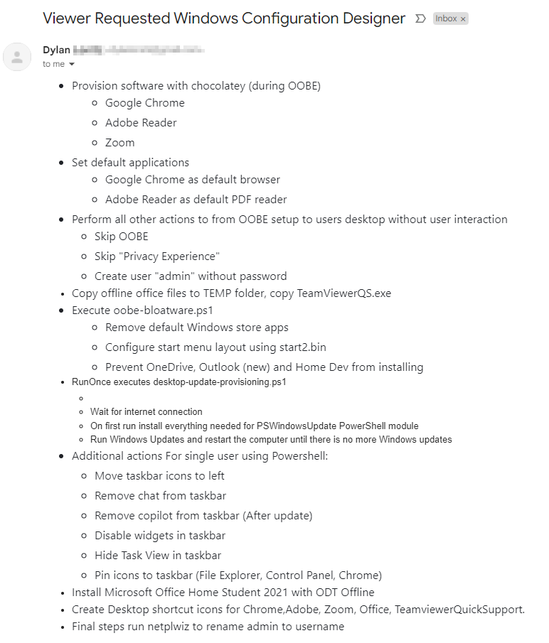

# Windows Configuration Designer: Creating viewer requested Windows automation package 02

<b>Request:</b>



## Package execution order:

<b>IMPORTANT NOTE:</b> Internet connection is required before executing package!

* <b>STAGE 1</b> Actions performed in OOBE:
    * Skip OOBE
    * Create C:\ProgramData\Provisioning folder
    * Execute oobe-setup.ps1
        * Create user "admin" without password
        * Disable Privacy Experience menu
        * Execute oobe-chocolatey.ps1
            * Install chocoltey (offline installation)
            * Using chocolatey install:
                * Google Chrome
                * Adobe Reader
                * Zoom
        * Execute oobe-associations.ps1
            * Set Adobe Reader as default PDF reader
            * Set Google Chrome as default browser
        * Execute oobe-bloatware.ps1
            * Remove default Windows store apps
            * Configure start menu layout
            * Prevent OneDrive, Outlook (new) and Home Dev from installing
        * Move Microsoft 365 files from usb drive to "C:\Windows\Temp" folder
        * Move necessary files from provisioning package to "C:\ProgramData\Provisioning" folder
            * TeamViewerQS_x64.exe
            * Scripts with desktop-* prefix
        * Configure RunOnce to execute desktop-update-provisioning.ps1

* <b>STAGE 2</b> Actions performed in admin users desktop:
    * RunOnce executes desktop-update-provisioning.ps1
        * Wait for internet connection
        * On first run install everything needed for PSWindowsUpdate PowerShell module
        * Run Windows Updates and restart the computer until there is no more Windows updates
        * Confgiure ActiveSetup to import user registry with RunOnce
            * Move taskbar icons to left
            * Remove chat from taskbar
            * Remove copilot from taskbar (After update)
            * Disable widgets in taskbar
            * Hide Task View in taskbar
        * Execute desktop-software-provisioning.ps1
            * Install Microsoft Office Home Student 2021 with ODT
            * Execute desktop-configure-taskbar.ps1
                * Pin Google Chrome
                * Pin Control Panel
                * Pin File Explorer
            * Execute desktop-shortcuts.ps1
                * Adobe Acrobat
                * Excel
                * World
                * TeamviewerQuickSupport
            * Execute netplwiz

## Creating package

### Step 1: Download Chocolatey, TeamViewer QS, Office deployment tool and scripts from GitHub

<b>Downloads:</b>

* [Chocolatey](https://github.com/chocolatey/choco)
* [TeamViewer Quick Support](https://www.teamviewer.com/en/solutions/use-cases/quicksupport/)
* [Office Deployment Tool](https://www.microsoft.com/en-us/download/details.aspx?id=49117)

### Step 2: Prepare Microsoft Office Home Student 2021 installation files

<b>Download installation files:</b>

```powershell
.\setup.exe /download .\Configuration.xml
```

### Step 3: Create start menu file

<b>Start layout location:</b>

```powershell
%LOCALAPPDATA%\Packages\Microsoft.Windows.StartMenuExperienceHost_cw5n1h2txyewy\LocalState\
```

### Step 4: Create provisioning package

<b>Execute oobe-setup.ps1:</b>

```powershell
powershell.exe -ExecutionPolicy Bypass -File oobe-setup.ps1
```

## Related videos

<b>PowerShell:</b>

* [PowerShell playlist](https://www.youtube.com/playlist?list=PLVncjTDMNQ4RDyVzbV0_kpXCScTMgUw_A)
* [Windows 11 set default applications for new users](https://youtu.be/K-o_iGZQPBo)

<b>Windows Configuration Designer:</b>

* [Windows Configuration Designer playlist](https://www.youtube.com/playlist?list=PLVncjTDMNQ4SAh9zjdreUBYSzSf7L5IX2)
* [Windows Configuration Designer: Downloading and installing](https://youtu.be/cSa12YaNMbU)
* [Windows Configuration Designer: Skip Out-Of-Box Experience](https://youtu.be/Lqf4i1nHV7I)
* [Windows Configuration Designer: Remove Windows 11 bloatware and configure start menu](https://youtu.be/lpbrQIvKGI4)
