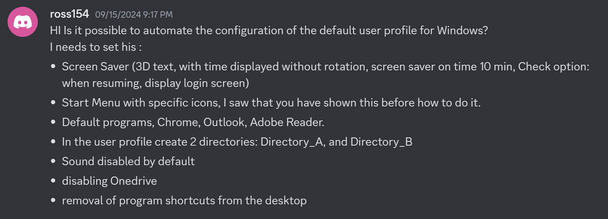

# Windows Configuration Designer: Creating viewer requested Windows automation package 03

<b>Request:</b>



<b>Updated request:</b>

* Enable file extensions
* Make sure that mailto: is set to outlook
* Leave Recycle bin

## Package execution order

* <b>STAGE 1</b> Actions performed in OOBE:
    * Skip OOBE
    * Execute oobe-setup.ps1
        * Execute oobe-chocolatey.ps1
            * Install chocoltey (offline installation)
            * Using chocolatey install:
                * Google Chrome
                * Adobe Reader
                * Microsoft Office 365
        * Create C:\ProgramData\Provisioning folder
        * Move files from provisioning package to C:\ProgramData\Provisioning
        * Create "C:\Users\Default\Directory_A", "C:\Users\Default\Directory_B" folders in default user profile
        * Delete shortcuts in C:\users\public\desktop folder
        * Set Adobe Reader as default PDF reader
        * Set Google Chrome as default browser
        * Set Outlook as default mail client
        * Deploy start menu layout
        * Create user "admin" without password
        * Disable Privacy Experience menu
        * Prevent OneDrive from installing
        * Configure ActiveSetup to execute user-commands.bat using RunOnce
* <b>STAGE 2</b> Actions performed in admin users desktop:
    * RunOnce executes user-commands.bat
        * Import user-settings.reg registry file
            * Scrensaver settings
            * Enable file extensions
            * Mute audio
            * Removes users desktop shortcuts

## Creating package

### Step 1: Download Chocolatey

<b>Downloads:</b>

* [Chocolatey](https://github.com/chocolatey/choco)

### Step 2: Create start menu file

<b>Install Office with chocolatey:</b>

```powershell
choco install office365business -y
```

<b>Start layout location:</b>

```powershell
%LOCALAPPDATA%\Packages\Microsoft.Windows.StartMenuExperienceHost_cw5n1h2txyewy\LocalState\
```

### Step 3: Create provisioning package

<b>Execute oobe-setup.ps1:</b>

```powershell
powershell.exe -ExecutionPolicy Bypass -File oobe-setup.ps1
```

## Related videos

<b>PowerShell:</b>

* [PowerShell playlist](https://www.youtube.com/playlist?list=PLVncjTDMNQ4RDyVzbV0_kpXCScTMgUw_A)
* [Windows 11 set default applications for new users](https://youtu.be/K-o_iGZQPBo)

<b>Windows Configuration Designer:</b>

* [Windows Configuration Designer playlist](https://www.youtube.com/playlist?list=PLVncjTDMNQ4SAh9zjdreUBYSzSf7L5IX2)
* [Windows Configuration Designer: Downloading and installing](https://youtu.be/cSa12YaNMbU)
* [Windows Configuration Designer: Skip Out-Of-Box Experience](https://youtu.be/Lqf4i1nHV7I)
* [Windows Configuration Designer: Remove Windows 11 bloatware and configure start menu](https://youtu.be/lpbrQIvKGI4)
