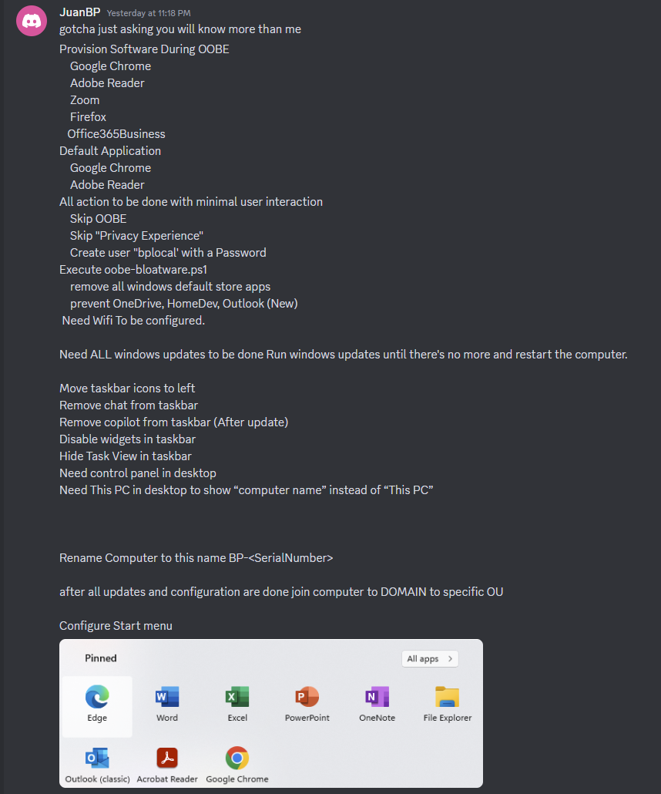
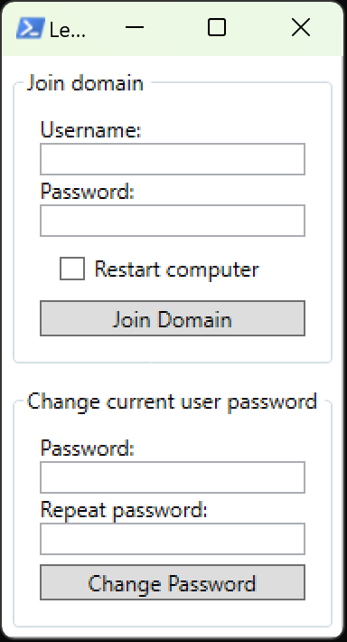

# Windows Configuration Designer: Creating viewer requested Windows automation package 04

<b>Request:</b>



## Package execution order

* <b>STAGE 1</b> Actions performed in OOBE:
    * Configure Wireless settings
    * Skip OOBE
    * Execute oobe-setup.ps1
        * Create C:\ProgramData\provisioning directory
        * Move necessary files from package to C:\ProgramData\provisioning
        * Create bplocal local user
        * Set computer name to BP-%SERIAL%
        * Install chocoltey (offline installation)
        * Set Google Chrome as default browser and Adobe Reader as default PDF reader
        * Remove windows store apps
        * Deploy start menu
        * Create desktop-user-registry.reg file
        * Prevent HomeDev, Outlook (New) from installing
        * Disable widgets
        * Skip privacy experiance
        * Configure ActiveSetup
           * Import desktop-user-registry.reg
           * Prevent OneDrive from installing
        * Configure RunOnce to execute desktop-update-provisioning.ps1 
* <b>STAGE 2</b> Actions performed in bplocal users desktop:
    * Execute desktop-update-provisioning.ps1
        * Wait for internet connection
        * On first run install everything needed for PSWindowsUpdate PowerShell module
        * Run Windows Updates and restart the computer until there is no more Windows updates
        * Using chocolatey install:
            * Zoom
            * Firefox
            * Office 365
            * Google Chrome
            * Adobe Reader
    * Import desktop-user-registry.reg (will repeat for each user on first logon)
        * Move taskbar icons to left
        * Remove chat, copilot, taskview from taskbar
        * Enable This PC and Control panel desktop icons
        * Rename This PC to computername
    * Join domain and set local admin password: </br>
        
    

## Prepare start menu layout files

### Step 1: Create start menu file

<b>Install software packages:</b>

```batch
choco install googlechrome adobereader Office365Business -y --no-progress --ignore-checksums
```

<b>Start layout location:</b>

```powershell
%LOCALAPPDATA%\Packages\Microsoft.Windows.StartMenuExperienceHost_cw5n1h2txyewy\LocalState\
```

## Creating package

### Create provisioning package

<b>Downloads:</b>

* [Chocolatey](https://github.com/chocolatey/choco)

<b>Execute oobe-setup.ps1:</b>

```powershell
powershell.exe -ExecutionPolicy Bypass -File oobe-setup.ps1
```

## Related videos

<b>PowerShell:</b>

* [PowerShell playlist](https://www.youtube.com/playlist?list=PLVncjTDMNQ4RDyVzbV0_kpXCScTMgUw_A)
* [Windows 11 set default applications for new users](https://youtu.be/K-o_iGZQPBo)

<b>Windows Configuration Designer:</b>

* [Windows Configuration Designer playlist](https://www.youtube.com/playlist?list=PLVncjTDMNQ4SAh9zjdreUBYSzSf7L5IX2)
* [Windows Configuration Designer: Downloading and installing](https://youtu.be/cSa12YaNMbU)
* [Windows Configuration Designer: Skip Out-Of-Box Experience](https://youtu.be/Lqf4i1nHV7I)
* [Windows Configuration Designer: Remove Windows 11 bloatware and configure start menu](https://youtu.be/lpbrQIvKGI4)
