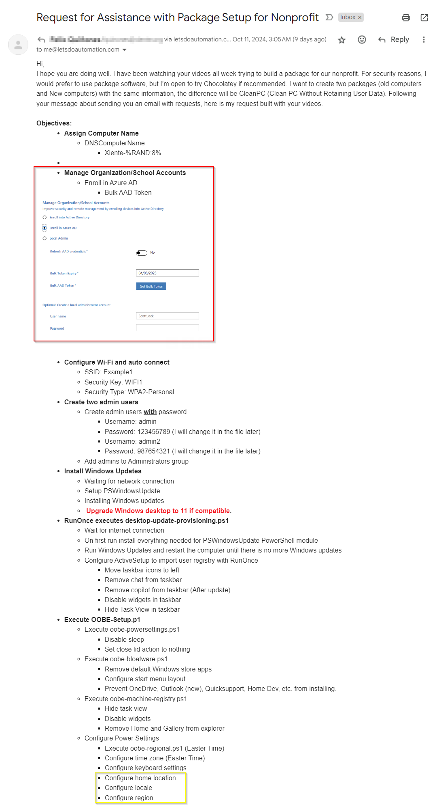
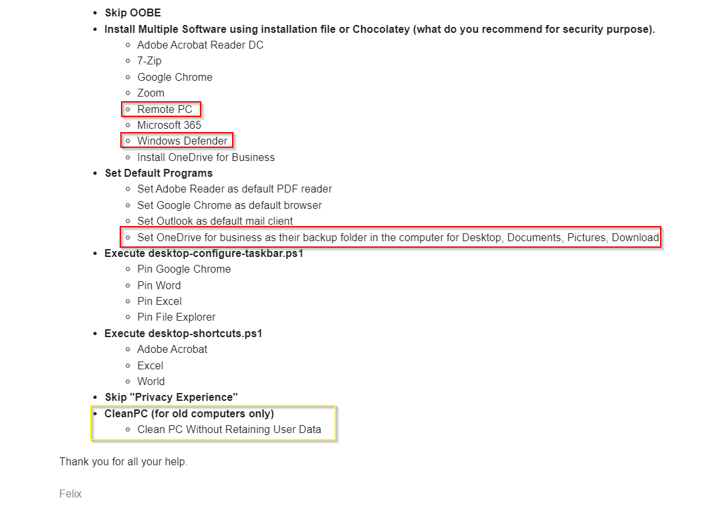

# Windows Configuration Designer: Creating viewer requested Windows automation package 05

<b>Request:</b>




## Automated actions

* Actions performed in OOBE by provisioning package:
    * Create local administrator accounts
        * admin
        * admin2
    * Set computer name to Xiente-%RAND:8%
    * Configure wireless settings
    * Disable OOBE
    * Execute oobe-setup.ps1
        * Create provisioning user
        * Add provisioning user to local administrators group
        * Configure autologon for provisioning user (Remove for CleanPC)
        * Create provisioning folder in C:\ProgramData directory
        * Copy files from provisioning package to C:\ProgramData\provisioning directory
        * Install chocolatey
        * Disable privacy experience menu
        * Disable widgets
        * Disable sleep and set close lid action to nothing
        * IF Windows 10
            * Configure RunOnce to execute desktop-upgrade.ps1
        * ELSE
            * Configure RunOnce to execute desktop-provisioning.ps1
* Actions performed in provisioning users desktop for Windows 10 only:
    * RunOnce executes desktop-upgrade.ps1
        * Wait for internet connection
        * Run Windows 11 upgrade compatibility check
            * IF no issues detected
                * Create autologon.bat file in provisioning folder
                * Execute upgrade to Windows 11
                * Execute autologon.bat
                    * Configure autologon
                    * Configure RunOnce to execute desktop-provisioning.ps1
            * ELSE
                * Execute desktop-provisioning.ps1
* Actions performed in provisioning users desktop:
    * desktop-upgrade.ps1 is execute from executing it directly or with RunOnce
        * Wait for internet connection
        * Install PSWindowsUpdate modules
        * Use PSWindowsUpdate to install windows updates
        * Restart if required, reconfigure autologon and re-run desktop-upgrade.ps1
        * Set time zone
        * Set default applications
            * Set Google Chrome as default browser
            * Set Adobe Reader as default PDF reader
            * Set Oulook as default mail client
        * Prevent OneDrive personal from installing
        * Pin aapplications to taskbar
        * Configure ActiveSetup to import desktop-user-registry.reg
        * IF Windows 10
            * Import Windows 10 start layout
            * Create desktop-user-registry.reg with Windows 10 user settings
        * ELSE
            * Remove Home and Gallery from file explorer
            * Create desktop-user-registry.reg with Windows 11 user settings
            * Configure keyboard language
            * Prevent Outlook (new) and Home dev from installing
            * Deploy Windows 11 start menu layout file
            * Configure ActiveSetup to remove Outlook (new) for each user on computer (Mainly for Windows 11 24h2)
        * Install chocolatey package
            * Adobe Reader
            * 7-Zip
            * Google Chrome
            * Zoom
            * Microsoft Office 365
        * Remove Windows store applications
        * Create desktop shortcuts
            * Adobe Reader
            * Word
            * Excel
        * Remove autologon registry entries
        * Remove provisioning user

## TODO

* Prepare USB drive with Windows 11 installation files (for Windows upgrade)
* Create Windows 11 start menu layout file
* Download chocolatey installation file
* Download all powershell scripts from GitHub

### Downloads

* [Chocolatey](https://github.com/chocolatey/choco)
* [MediaCreationTool](https://www.microsoft.com/en-us/software-download/windows11)

### Create start menu file

<b>Install Microsoft Office:</b>

```batch
choco install office365business -y --no-progress --ignore-checksums
```

<b>Start layout location:</b>

```powershell
%LOCALAPPDATA%\Packages\Microsoft.Windows.StartMenuExperienceHost_cw5n1h2txyewy\LocalState\
```

## Create provisioning package

* Setup administrator accounts
    * admin
    * admin2
* Setup computer name
* Configure wireless settings
* Set HideOobe value to True
* Package files
    * desktop-provisioning.ps1
    * desktop-upgrade.ps1
    * oobe-setup.ps1
    * start2.bin
    * chocolatey-2.3.0.0.msi
* Configure oobe-setup.ps1 execution

<b>Computer name pattern:</b>

```
Xiente-%RAND:8%
```

<b>oobe-setup.ps1 execution:</b>

```powershell
powershell.exe -ExecutionPolicy Bypass -File oobe-setup.ps1 -choco_executable "chocolatey-2.3.0.0.msi" -username "provisioning" -password "password55" -usb_name "ESD-USB"
```

## Related videos

<b>PowerShell:</b>

* [PowerShell playlist](https://www.youtube.com/playlist?list=PLVncjTDMNQ4RDyVzbV0_kpXCScTMgUw_A)
* [Windows 11 set default applications for new users](https://youtu.be/K-o_iGZQPBo)

<b>Windows Configuration Designer:</b>

* [Windows Configuration Designer playlist](https://www.youtube.com/playlist?list=PLVncjTDMNQ4SAh9zjdreUBYSzSf7L5IX2)
* [Windows Configuration Designer: Downloading and installing](https://youtu.be/cSa12YaNMbU)
* [Windows Configuration Designer: Skip Out-Of-Box Experience](https://youtu.be/Lqf4i1nHV7I)
* [Windows Configuration Designer: Remove Windows 11 bloatware and configure start menu](https://youtu.be/lpbrQIvKGI4)
