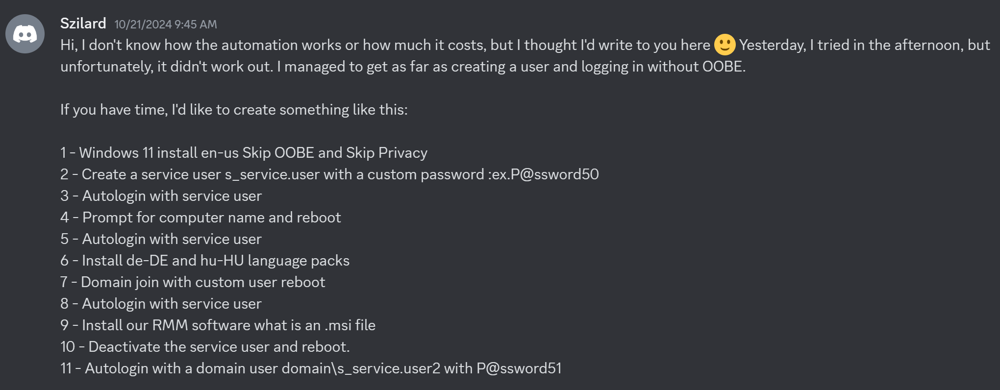
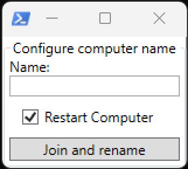

# Windows Configuration Designer: Creating viewer requested Windows automation package 06

<b>Request:</b>



<b>Request update:</b>

* Select organization unit by computer names first letters

## Automated actions

* Actions performed in OOBE by provisioning package:
    * Skip OOBE
    * Execute oobe-setup.ps1
        * Create C:\ProgramData\provisioning
        * Copy files from provisioning package to C:\ProgramData\provisioning directory
        * Create s_service.user local administrator user
        * Disable privacy experience menu
        * Configure autologon for s_service.user
        * Configure RunOnce to execute desktop-provisioning.ps1
        * Configure Active Setup to disable start menu from opening
* Actions performed by desktop-provisioning.ps1 in provisioning users Desktop
    * Install de-DE, hu-HU languages
    * Execute GUI for setting computername
    * 
    * Join computer to domain
    * Configure autologon for domain user
    * Configure RunOnce to execute desktop-software-provisioning.ps1
    * Rename computer and restart
* Actions performed by desktop-software-provisioning.ps1 in provisioning users Desktop
    * Install .msi files (will be using googlechromestandaloneenterprise64.msi as an example)

### Downloads

* [Google Chrome](https://chromeenterprise.google/download/)

<b>oobe-setup.ps1 execution:</b>

```powershell
powershell.exe -ExecutionPolicy Bypass -File oobe-setup.ps1 -local_username "s_service.user" -local_password "P@ssword50" -domain_username "s_service.user2" -domain_password "P@ssword51" -domain_name "ad.letsdoautomation.com"
```

## Related videos

<b>PowerShell:</b>

* [PowerShell playlist](https://www.youtube.com/playlist?list=PLVncjTDMNQ4RDyVzbV0_kpXCScTMgUw_A)

<b>Windows Configuration Designer:</b>

* [Windows Configuration Designer playlist](https://www.youtube.com/playlist?list=PLVncjTDMNQ4SAh9zjdreUBYSzSf7L5IX2)
* [Windows Configuration Designer: Downloading and installing](https://youtu.be/cSa12YaNMbU)
* [Windows Configuration Designer: Skip Out-Of-Box Experience](https://youtu.be/Lqf4i1nHV7I)
* [Windows Configuration Designer: Remove Windows 11 bloatware and configure start menu](https://youtu.be/lpbrQIvKGI4)
