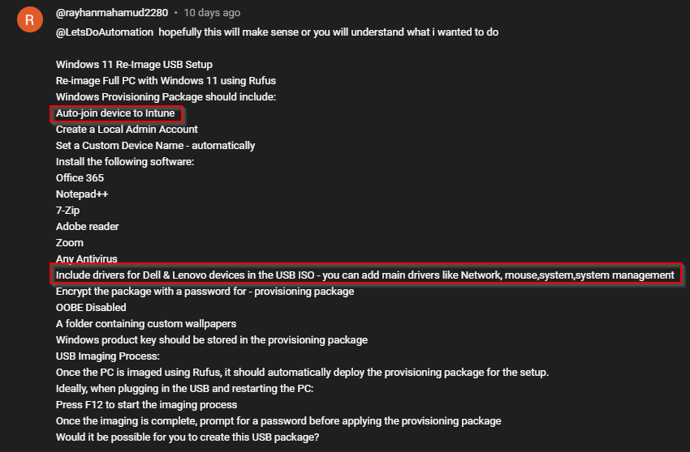

# Windows Configuration Designer: Creating viewer requested Windows automation package 07

<b>Request:</b>



<b>Documentation:</b>

* [Key Management Services (KMS) client activation and product keys](https://learn.microsoft.com/en-us/windows-server/get-started/kms-client-activation-keys?tabs=server2025%2Cwindows1110ltsc%2Cversion1803%2Cwindows81)

## Automated actions

* Actions performed in OOBE by autounattend.xml
  * Select en-us language
  * Prepare partitions for Windows installation
  * Install Windows 11 PRO
* Actions performed in OOBE by provisioning package
  * Disable OOBE 
  * Change computer name to SiteCode-%SERIAL%
  * Enter Windows license key
  * Execute oobe-setup.ps1
    * Create admin account
    * Move files from provisioning package to C:\PrograData\Provisioning folder
    * Configure RunOnce to execute desktop-provisioning.ps1
    * Disable privacy experiance menu
* Actions performed in users desktop by desktop-provisioning.ps1
  * Wait for network connection
  * Install <b>VMware Tools</b>
  * Install wallpapers
  * Install Office 365
  * Install 7-Zip
  * Install Notepad++
  * Install Zoom
  * Install Adobe Reader
  * Install Avast

<b>Downloads:</b>

* [Windows 11](https://www.microsoft.com/en-us/software-download/windows11)
* [Rufus](https://rufus.ie/en/)
* [Office Deployment Tool](https://www.microsoft.com/en-us/download/details.aspx?id=49117)
* [7-Zip](https://7-zip.org/download.html)
* [Notepad++](https://notepad-plus-plus.org/downloads/v8.7.7/)
* [Zoom](https://support.zoom.com/hc/en/article?id=zm_kb&sysparm_article=KB0060407)
* [Adobe Reader](https://get.adobe.com/reader/enterprise/)
* [Avast](https://www.avast.com/free-antivirus-download#pc)

<b>Computer name pattern:</b>

```batch
DK-%SERIAL%
```

<b>KMS Windows 11 Pro key:</b>

```batch
W269N-WFGWX-YVC9B-4J6C9-T83GX
```

<b>oobe-setup.ps1 execution:</b>

```powershell
powershell.exe -ExecutionPolicy Bypass -File oobe-setup.ps1
```

## Related videos

<b>PowerShell:</b>

* [PowerShell playlist](https://www.youtube.com/playlist?list=PLVncjTDMNQ4RDyVzbV0_kpXCScTMgUw_A)

<b>Windows Configuration Designer:</b>

* [Windows Configuration Designer playlist](https://www.youtube.com/playlist?list=PLVncjTDMNQ4SAh9zjdreUBYSzSf7L5IX2)
* [Windows Configuration Designer: Downloading and installing](https://youtu.be/cSa12YaNMbU)
* [Windows Configuration Designer: Skip Out-Of-Box Experience](https://youtu.be/Lqf4i1nHV7I)
* [Windows Configuration Designer: Remove Windows 11 bloatware and configure start menu](https://youtu.be/lpbrQIvKGI4)
