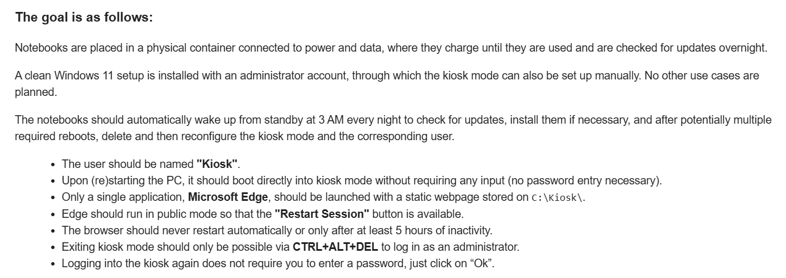

# Windows Configuration Designer: Creating viewer requested Windows automation package 08

<b>Documentation:</b>

* [AssignedAccess (Windows Configuration Designer reference)](https://learn.microsoft.com/en-us/windows/configuration/wcd/wcd-assignedaccess#assignedaccesssettings)
* [Create an Assigned Access configuration XML file](https://learn.microsoft.com/en-us/windows/configuration/assigned-access/configuration-file?pivots=windows-11)
* [Configure Microsoft Edge kiosk mode](https://learn.microsoft.com/en-us/deployedge/microsoft-edge-configure-kiosk-mode)
* [Configure a restricted user experience (multi-app kiosk) with Assigned Access](https://learn.microsoft.com/en-us/windows/configuration/assigned-access/configure-multi-app-kiosk?tabs=ppkg)

<b>Request:</b>



## Automated provisioning package actions

* Actions performed in OOBE by provisioning package
  * Disable OOBE
  * Create admin account
  * Execute oobe-setup.ps1
    * Set admin password to never expires
    * Create C:\PrograData\Provisioning folder on the computer
    * Move files from provisioning package to C:\PrograData\Provisioning folder
    * Deploy static web page to C:\Kiosk\
    * Configure Kiosk
      * Launch Microsoft Edge on startup
      * Set startup page to C:\Kiosk\index.html
    * Pause Windows Updates for 30 days  
    * Configure Windows task scheduler
      * Run daily at '3:00 AM'
      * Run under System user
      * Execute desktop-updates.ps1
        * Wait for network connection
        * Resume Windows updates
        * Install PSWindowsUpdate powershell module
        * Install Windows updates
        * Pause Windows Updates for 30 days
        * If updates are found, installed and if restart is required
          * Sign out KIOSK user
          * Remove KIOSK configuration
          * Re-configure KIOSK
          * Restart computer
    * Configure AC power settings
      * Disable hibernate 
      * Sleep after 45 mins
      * Turn off monitor after 45 min

## Creating package

<b>oobe-setup.ps1 execution:</b>

```powershell
powershell.exe -ExecutionPolicy Bypass -File oobe-setup.ps1
```

## Removing kiosk configuration

<b>Downloads:</b>

* [PsTools](https://learn.microsoft.com/en-us/sysinternals/downloads/pstools)

<b>Execute powershell as system:</b>

```batch
PsExec.exe -i -s powershell
```

<b>Remove KIOSK configuration:</b>

```powershell
$get_cim_instance = @{
    Namespace = "root\cimv2\mdm\dmmap"
    ClassName = "MDM_AssignedAccess"
}

$cim_instance = Get-CimInstance @get_cim_instance
$cim_instance.Configuration = $null
Set-CimInstance -CimInstance $cim_instance
```

## Related videos

<b>PowerShell:</b>

* [PowerShell playlist](https://www.youtube.com/playlist?list=PLVncjTDMNQ4RDyVzbV0_kpXCScTMgUw_A)

<b>Windows Configuration Designer:</b>

* [Windows Configuration Designer playlist](https://www.youtube.com/playlist?list=PLVncjTDMNQ4SAh9zjdreUBYSzSf7L5IX2)
* [Windows Configuration Designer: Downloading and installing](https://youtu.be/cSa12YaNMbU)