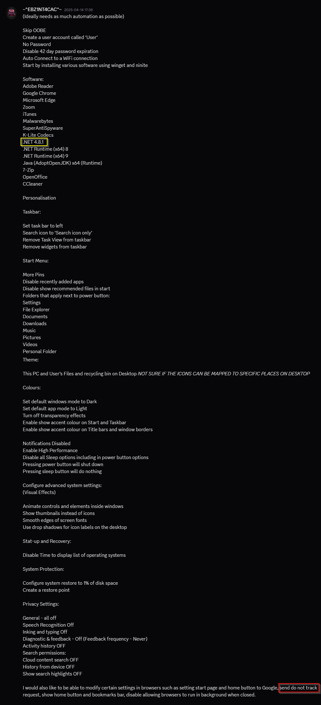

# Windows Configuration Designer: Creating viewer requested Windows setup automation package 10

<b>Documentation:</b>

[Apply Edge policies for non domain joined devices](https://hitco.at/blog/apply-edge-policies-for-non-domain-joined-devices/)

<b>Request:</b>



* Actions performed in OOBE by provisioning package
  * Disable OOBE
  * Configure WiFi network
  * Execute oobe-setup.ps1
    * Create "user" account
    * Create C:\PrograData\Provisioning folder on the computer
    * Move files from provisioning package to C:\PrograData\Provisioning folder
    * Disable "Privacy experience" menu
    * Configure RunOnce to execute desktop-provisioning.ps1
* Actions performed by desktop-provisioning.ps1 in users Desktop
  * Move taskbar to left side
  * Change search bar to search icon
  * Remove taskview button from taskbar
  * Enable this PC desktop icon
  * Enable user files desktop icon
  * Enable recycle bin desktop icon
  * Set more pins for start menu
  * Set Windows dark theme
  * Set light theme for applications
  * Disable theme transparency
  * Enable accent colors for taskbar and start menu
  * Disable notifications
  * Enable animate controls and elements inside windows
  * Enable smooth edges of screen fonts
  * Disable show window contents while dragging
  * Disable animate windows when minimizing and maximizing
  * Enable show thumbnails instead of icons
  * Enable use drop shadows for icon labels on the desktop
  * Disable animations in the taskbar
  * Disable show translucent selection rectangle
  * Disable peek
  * Disable let websites provide locally relevant content by accessing my language list
  * Disable let Windows improve Start and search results by tracking app launches
  * Disable show me suggested content in settings app
  * Disable show me notifications in settings app
  * Disable inking & typing personalization
  * Set never feedback frequency
  * Disable tailored experiences
  * Disable history from device
  * Disable taskbar widgets
  * Hide recently added apps
  * Start pin documents
  * Start pin file explorer
  * Start pin downloads
  * Start pin personal folder
  * Start pin music folder
  * Start pin video folder
  * Start pin picture folder
  * Start pin settings
  * Disable disable online speech recognition
  * Disable Diagnostic & feedback
  * Disable Activity history
  * Disable Cloud content search
  * Disable search highlights
  * Configure <span style="color:red">FAKE MDM</span>
  * Set Google Chrome home page
  * Set Google Chrome home page as new tab page
  * Enable Google Chrome bookmarks bar
  * Enable Google Chrome home button
  * Disable Google Chrome background mode
  * Configure power settings
  * Configure RunOnce to execute desktop-provisioning.ps1
  * Restart computer
* Actions performed by desktop-provisioning-2.ps1 in users Desktop
  * Wait for internet connection
  * Wait for winget to be installed
  * Set time to display list of operating systems to 0
  * Install software using winget
    * Google Chrome
    * Adobe Acrobat Reader
    * Zoom
    * iTunes
    * Malwarebytes
    * K-Lite Codec Pack
    * Microsoft DotNet Runtime 8
    * Microsoft DotNet Runtime 9
    * AdoptOpenJDK
    * 7zip
    * Open Office
    * CCleaner
  * Install software using Ninite
    * SUPERAntiSpyware
  * Wait 5 minutes for Ninite to finish software installation
  * Close Ninite
  * Enable system restore
  * Configure system restore to use 1% of disk space
  * Create restore point

<b>Downloads:</b>

* [Ninite](https://ninite.com/)

<b>oobe-setup.ps1 execution:</b>

```powershell
powershell.exe -ExecutionPolicy Bypass -File oobe-setup.ps1
```

## Related videos

<b>PowerShell:</b>

* [PowerShell playlist](https://www.youtube.com/playlist?list=PLVncjTDMNQ4RDyVzbV0_kpXCScTMgUw_A)

<b>Windows Configuration Designer:</b>

* [Windows Configuration Designer playlist](https://www.youtube.com/playlist?list=PLVncjTDMNQ4SAh9zjdreUBYSzSf7L5IX2)
* [Windows Configuration Designer: Downloading and installing](https://youtu.be/cSa12YaNMbU)
* [Windows Configuration Designer: Skip Out-Of-Box Experience](https://youtu.be/Lqf4i1nHV7I)
* [Windows Configuration Designer: Remove Windows 11 bloatware and configure start menu](https://youtu.be/lpbrQIvKGI4)