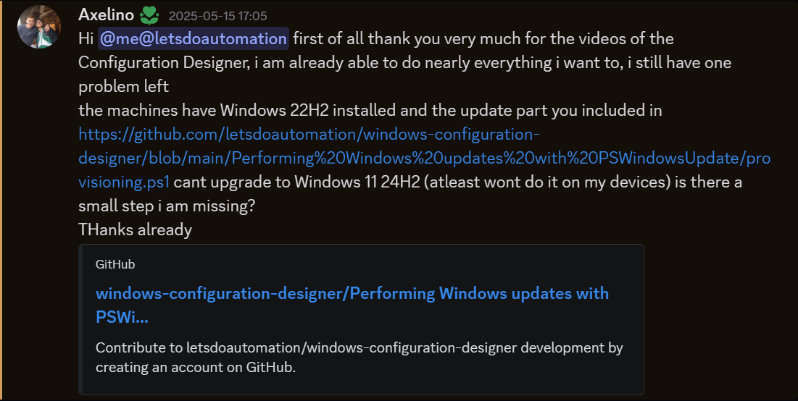

# Windows Configuration Designer: Creating viewer requested Windows setup automation package 12

<b>Request:</b>



* Actions performed in OOBE by provisioning package
  * Disable OOBE
  * Execute oobe-setup.ps1
    * Create "admin" account
    * Create C:\PrograData\provisioning folder on the computer
    * Move files from provisioning package to C:\PrograData\provisioning folder
    * Disable "Privacy experience" menu
    * Configure Power Settings (Disable sleep and monitor off)
    * Configure RunOnce to execute desktop-provisioning.ps1
* Actions performed in users Desktop
  * Perform Windows updates
  * <b>IF</b> Windows version lower than 24H2 then desktop-upgrade.ps1 is executed
    * Attemp upgrade to 24H2 version
    * Execute desktop-provisioning.ps1

<b>Downloads:</b>

* [Media Creation Tool](https://www.microsoft.com/en-us/software-download/windows11)

<b>oobe-setup.ps1 execution:</b>

```powershell
powershell.exe -ExecutionPolicy Bypass -File oobe-setup.ps1
```

## Related videos

<b>PowerShell:</b>

* [PowerShell playlist](https://www.youtube.com/playlist?list=PLVncjTDMNQ4RDyVzbV0_kpXCScTMgUw_A)

<b>Windows Configuration Designer:</b>

* [Windows Configuration Designer playlist](https://www.youtube.com/playlist?list=PLVncjTDMNQ4SAh9zjdreUBYSzSf7L5IX2)
* [Windows Configuration Designer: Downloading and installing](https://youtu.be/cSa12YaNMbU)
* [Windows Configuration Designer: Skip Out-Of-Box Experience](https://youtu.be/Lqf4i1nHV7I)
* [Windows Configuration Designer: Remove Windows 11 bloatware and configure start menu](https://youtu.be/lpbrQIvKGI4)