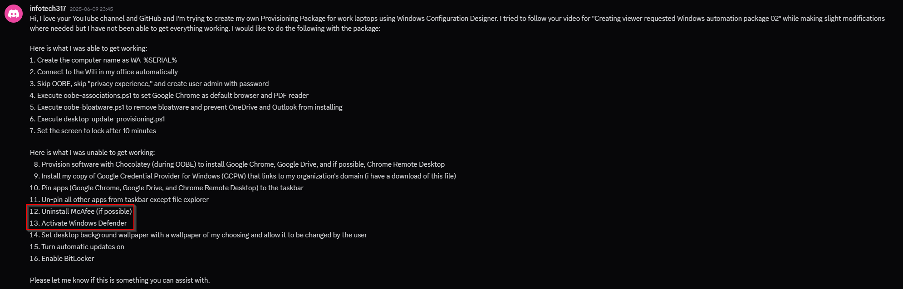

# Windows Configuration Designer: Creating viewer requested Windows setup automation package 13

<b>Request:</b>



* Actions performed in OOBE by provisioning package
  * Disable OOBE
  * Set computer name WA-%SERIAL%
  * Configure wireless connection
  * Execute oobe-setup.ps1
    * Create "admin" account
    * Create C:\PrograData\provisioning folder on the computer
    * Move files from provisioning package to C:\PrograData\provisioning folder
    * Set Google Chrome as default browser and PDF reader
    * Remove Windows Store applications
    * Prevent Outlook (new) from installing (for older Windows 11 versions)
    * Install Chocolatey
    * Install Google Credential Provider for Windows
    * Install Google Chrome chocolatey package
    * Install Google Drive chocolatey package
    * Create Chrome remote desktop shortcut
    * Pin applications to taskbar
      * Explorer
      * Google Chrome
      * Google Drive
      * Chrome remote desktop
    * Apply registry settings
      * Install Google Chrome remote desktop extension
      * Install Google Chrome remote desktop PWA
      * Disable "Privacy experience" menu
      * Configure taskbar
      * Configure ActiveSetup to execute desktop-user-provisioning.ps1
      * Configure RunOnce to execute desktop-provisioning.ps1
      * Disable cloud content features (to remove Outlook from taskbar)
      * Enable "Get Latest Updates as soon as they're available"
      * Configure GCPW enrollment token
    * Configure power settings (Disable sleep and monitor off)

<b>Actions performend by desktop-user-activesetup.ps1:</b>

* Prevent OneDrive from installing
* Configure RunOnce to execute desktop-user-runonce.ps1

<b>Actions performend by desktop-user-runonce.ps1:</b>

* Configure wallpaper
* Remove Windows Store applications
  * Copilot
  * Outlook

<b>Actions performed by desktop-provisioning.ps1:</b>

* Install Windows updates
* Apply registry settings
  * Configure lock screen(after 10 minutes)
* Enable Bitlocker
* Execute batch file
* Execute GUI for setting user password

<b>Downloads:</b>

* [Chocolatey](https://github.com/chocolatey/choco)
* [Google Credential Provider for Windows®](https://tools.google.com/dlpage/gcpw/)

<b>Configure computer name:</b>

```batch
WA-%SERIAL%
```

<b>oobe-setup.ps1 execution:</b>

```powershell
powershell.exe -ExecutionPolicy Bypass -File oobe-setup.ps1
```

## Related videos

<b>PowerShell:</b>

* [PowerShell playlist](https://www.youtube.com/playlist?list=PLVncjTDMNQ4RDyVzbV0_kpXCScTMgUw_A)

<b>Windows Configuration Designer:</b>

* [Windows Configuration Designer playlist](https://www.youtube.com/playlist?list=PLVncjTDMNQ4SAh9zjdreUBYSzSf7L5IX2)
* [Windows Configuration Designer: Downloading and installing](https://youtu.be/cSa12YaNMbU)
* [Windows Configuration Designer: Skip Out-Of-Box Experience](https://youtu.be/Lqf4i1nHV7I)
* [Windows Configuration Designer: Remove Windows 11 bloatware and configure start menu](https://youtu.be/lpbrQIvKGI4)
