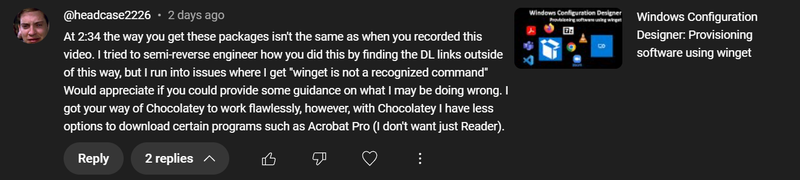

# Windows Configuration Designer: Install software using winget in Windows 24H2

<b>Request:</b>



## Automated actions

* Actions performed in OOBE by provisioning package:
  * Skip OOBE
  * Execute oobe-setup.ps1
    * Create C:\ProgramData\provisioning
    * Copy files from provisioning package to C:\ProgramData\provisioning directory
    * Create local administrator user
    * Disable privacy experience menu
    * Configure RunOnce to execute desktop-provisioning.ps1
* Actions performed by desktop-provisioning.ps1 in provisioning users Desktop
  * Wait for internet connection
  * Wait for winget to be installed
  * Install software using winget
    * Adobe Reader
    * Google Chrome
    * 7-zip
    * Mozzila Firefox
    * Zoom
    * Visual studio code
    * VLC

<b>oobe-setup.ps1 execution:</b>

```powershell
powershell.exe -ExecutionPolicy Bypass -File oobe-setup.ps1
```

## Related videos

<b>PowerShell:</b>

* [PowerShell playlist](https://www.youtube.com/playlist?list=PLVncjTDMNQ4RDyVzbV0_kpXCScTMgUw_A)

<b>Windows Configuration Designer:</b>

* [Windows Configuration Designer playlist](https://www.youtube.com/playlist?list=PLVncjTDMNQ4SAh9zjdreUBYSzSf7L5IX2)
* [Windows Configuration Designer: Downloading and installing](https://youtu.be/cSa12YaNMbU)
* [Windows Configuration Designer: Skip Out-Of-Box Experience](https://youtu.be/Lqf4i1nHV7I)
* [Windows Configuration Designer: Remove Windows 11 bloatware and configure start menu](https://youtu.be/lpbrQIvKGI4)